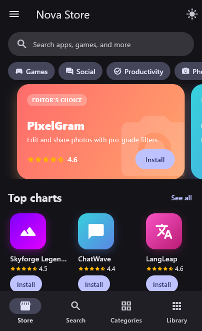
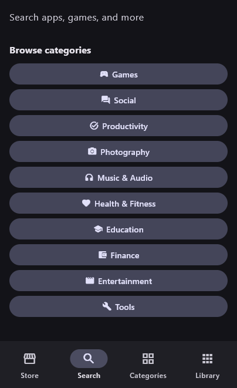
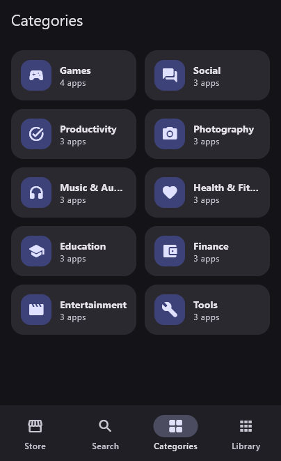
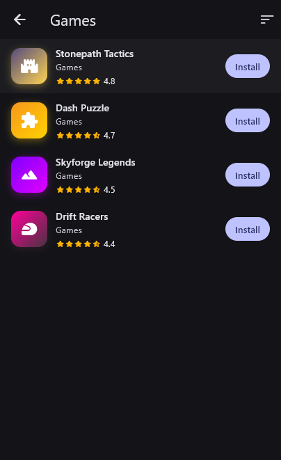
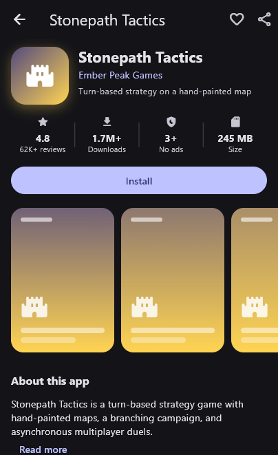
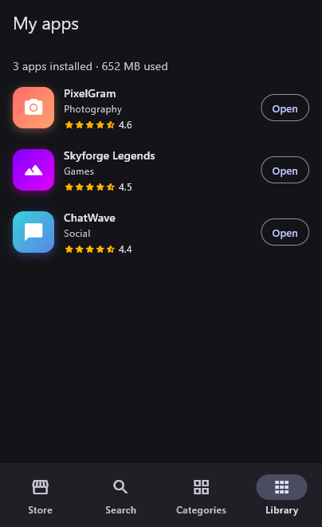
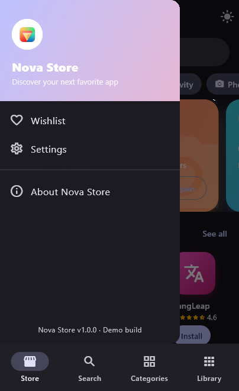
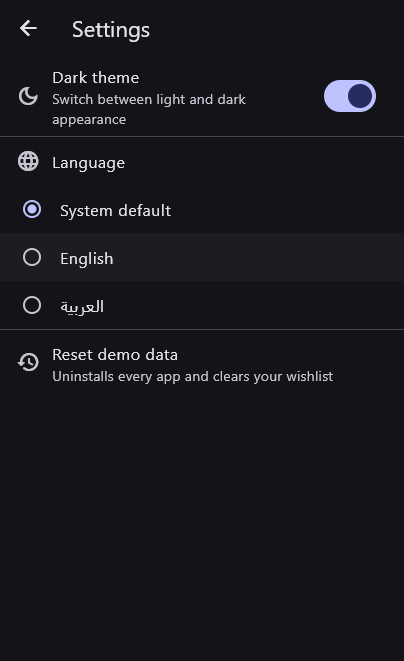

# Nova Store

🌐 **Live Website:**

  http://novapp.xo.je/?i=1

A polished, fully offline app-marketplace UI built with Flutter — a portfolio
piece showcasing UI/UX craftsmanship, state management, and clean project
structure. All apps, developers, and reviews are fictional demo data.


## Features

- **Home** — editor's choice carousel, category chips, top charts, and
  new & updated rails
- **Search** — live filtering by app name, developer, category, or tagline
- **Categories** — 10 categories with sortable listings (top rated, most
  downloaded, name)
- **App details** — stats row, screenshot gallery, expandable description,
  rating distribution, and user reviews
- **Library** — tracks installed apps and total storage used
- **Install lifecycle** — tap Install to watch a real animated progress
  ring, then Open/long-press-to-uninstall — all in-memory, no backend
- **Wishlist** — heart an app from its details page, browse saved apps from
  the drawer
- **Settings** — dark theme switch, language picker, and a one-tap reset of
  all demo data
- **About** — app info, a tappable star rating, and a mock feedback action
- **Light/dark theme** toggle, resolved from the system theme on first launch
- **Localization** — English and Arabic, with full right-to-left layout
  mirroring; follows the system language by default, or pick one in Settings

No network calls and no backend: app icons and screenshots are generated at
runtime from gradients, so the app looks good and runs identically offline,
in CI, or on a fresh emulator with no setup.

## Tech stack

- Flutter 3 / Dart 3, Material 3
- [`provider`](https://pub.dev/packages/provider) for state management
  (`LibraryProvider` for installs/wishlist, `ThemeProvider` for theming,
  `LocaleProvider` for language)
- Flutter's official ARB + `gen-l10n` localization tooling
  (`flutter_localizations`, `intl`) — see [Localization](#localization) below
- Local, in-memory mock data (`lib/data/mock_data.dart`) — no API keys or
  backend required to run

## Project structure

```
lib/
  data/          mock catalog of fictional apps
  l10n/          app_en.arb / app_ar.arb (source strings; generated/ is gitignored)
  models/        AppInfo, Review, AppCategory
  state/         ChangeNotifier providers
  screens/       one file per top-level screen
  widgets/       reusable UI pieces (icons, cards, install button, ...)
  utils/         formatting helpers (counts, sizes, prices, dates)
```

## Localization

UI strings live in `lib/l10n/app_en.arb` (template) and `lib/l10n/app_ar.arb`,
and `flutter gen-l10n` generates the `AppLocalizations` class into
`lib/l10n/generated/` — that folder is gitignored and regenerates
automatically on `flutter pub get` / `flutter run` / `flutter build` because
`pubspec.yaml` sets `flutter: generate: true`.

To add a language: add a new `app_<locale>.arb` file with the same keys,
translate the values, then add a matching `RadioListTile` entry in
`settings_screen.dart`'s language picker.

Scope note: UI chrome (buttons, labels, dialogs, category names, relative
dates) is fully localized. The mock catalog itself — app names, taglines,
descriptions, and reviews — is intentionally left in English, the same way a
real store doesn't machine-translate a developer's own listing copy.

## Getting started

```bash
flutter pub get
flutter run
```

Run the tests:

```bash
flutter test
```

## Screenshots

<p align="center">
  
  
  
  
</p>
<p align="center">
  
  
  
  
</p>


## 📥 Download the App

👉 [Download Groupify APK V1.0.0](https://github.com/huzaifakhashan/AppStore/releases/tag/v1.0.0)


